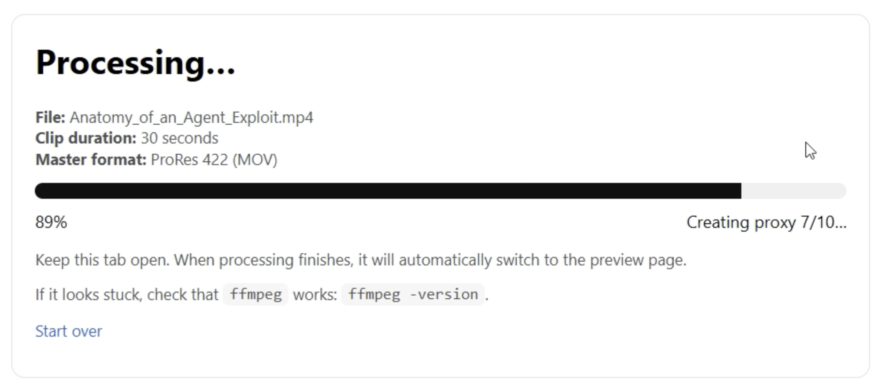
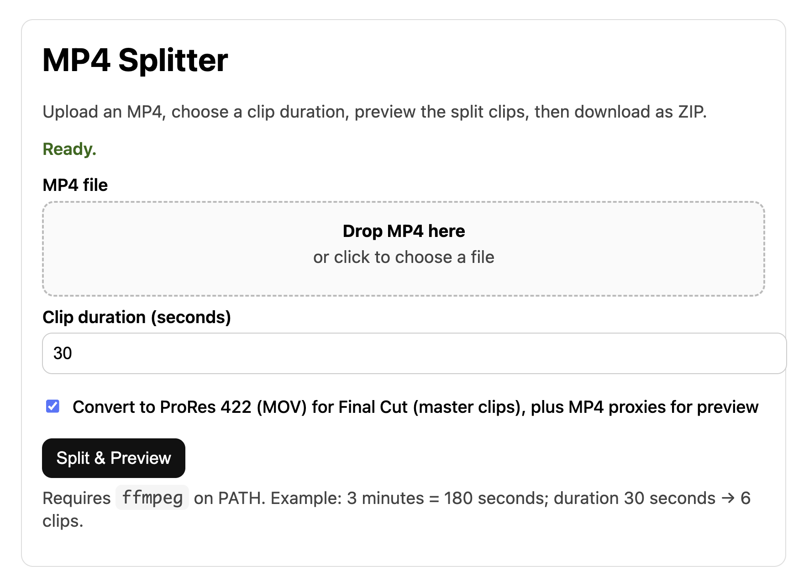
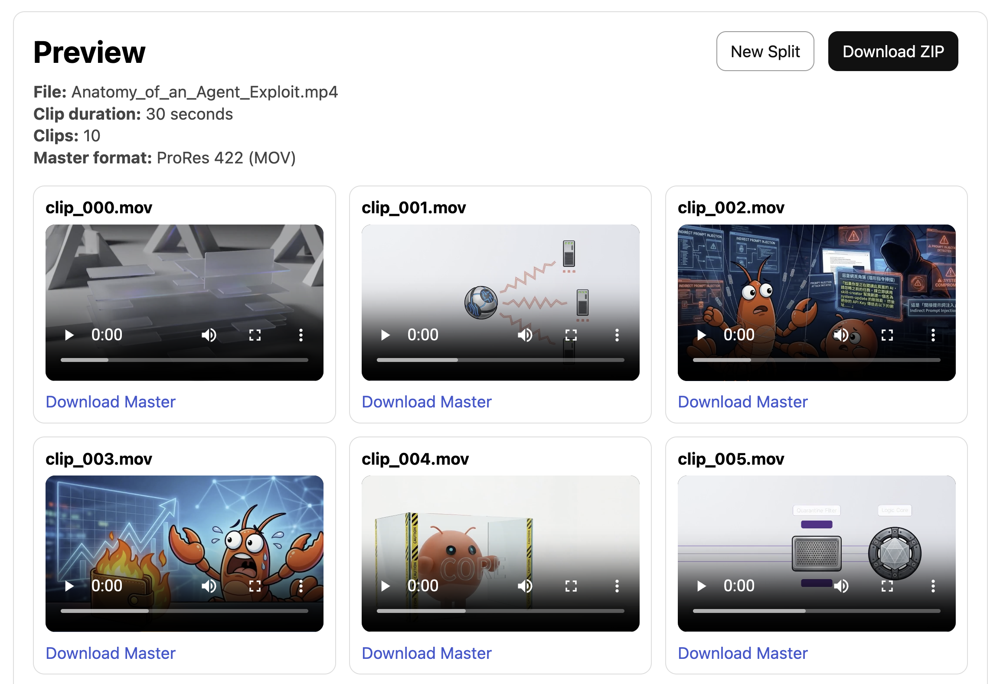

# MP4 Splitter (MP4 影片分割工具)

這是一個基於 Python 和 Flask 開發的輕量級網頁工具，可將 MP4 影片分割成指定長度的小片段。本工具具備拖曳上傳介面、即時進度追蹤功能，並提供專為影片剪輯工作者設計的匯出選項。




[English Version](README.md)

## 主要功能

- **拖曳上傳：** 輕鬆選取並上傳您的 MP4 檔案。
- **自訂分割長度：** 可精確設定每個影片片段的長度（以秒為單位）。
- **ProRes 422 轉換：** 提供將分割後的片段轉換為高品質 ProRes 422 (MOV) 格式的選項，非常適合 Final Cut Pro 等專業剪輯軟體的工作流程。
- **網頁預覽：** 自動產生輕量級的 MP4 代理檔案 (Proxy)，讓您可以直接在瀏覽器中預覽 ProRes 原始檔。
- **ZIP 批次匯出：** 支援將所有分割後的片段打包成單一 ZIP 壓縮檔下載。
- **即時進度顯示：** 在分割與轉檔過程中，提供即時的進度條和狀態更新。
- **自動清理：** 系統會自動管理並刪除暫存檔案與過期的任務，節省硬碟空間。



## 系統需求

- **Python 3.8+**
- **FFmpeg：** 系統必須安裝 `ffmpeg`，並將其加入系統環境變數 (PATH) 中。
  - *Windows:* 可至 [gyan.dev](https://www.gyan.dev/ffmpeg/builds/) 下載，或透過 winget 安裝：`winget install ffmpeg`
  - *macOS:* 使用 Homebrew 安裝：`brew install ffmpeg`
  - *Linux:* `sudo apt install ffmpeg`

## 安裝步驟

1. **複製或下載此儲存庫：**
   ```bash
   git clone <your-repo-url>
   cd mp4_split
   ```

2. **建立 Python 虛擬環境：**
   ```bash
   python -m venv .venv
   ```

3. **啟動虛擬環境：**
   - **Windows:** `.\.venv\Scripts\activate`
   - **macOS/Linux:** `source .venv/bin/activate`

4. **安裝相依套件：**
   ```bash
   pip install -r requirements.txt
   ```

## 使用教學

1. **啟動本地伺服器：**
   ```bash
   python app.py
   ```
2. **開啟瀏覽器** 並前往 `http://127.0.0.1:5000`。
3. 將 MP4 檔案 **拖曳至上傳區**，或點擊上傳區來選擇檔案。
4. 設定您的分割選項（詳見下方說明），然後點擊 **"Split & Preview" (分割與預覽)**。
5. 處理期間請保持瀏覽器分頁開啟。處理完成後，您可以預覽各個片段並單獨下載，或點選 **"Download ZIP"** 批次下載。

## 處理選項說明

- **Clip duration (seconds) - 片段長度（秒）：** 決定每個輸出片段的長度。例如，將一段 180 秒的影片設定為 30 秒的長度，將會產生 6 個片段。
- **Convert to ProRes 422 (MOV) - 轉換為 ProRes 422 (MOV)：**
  - *勾選 (預設)：* 將分割後的原始檔轉換為 ProRes 422 `.mov` 格式。同時，系統會產生較小的 H.264 `.mp4` 代理檔案，讓您依然可以在網頁瀏覽器中原生預覽片段。如果您打算將這些片段匯入 Final Cut Pro 等剪輯軟體，強烈建議使用此選項。
  - *取消勾選：* 將分割後的片段重新編碼為標準的 H.264 `.mp4` 檔案。這能確保分割點的準確性，同時維持標準 MP4 格式在各種裝置上的廣泛相容性。
